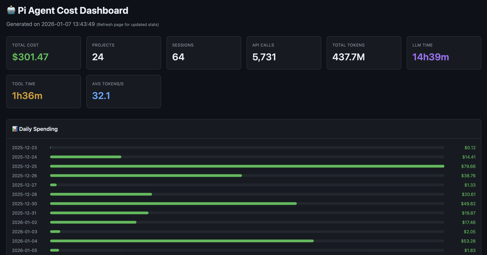
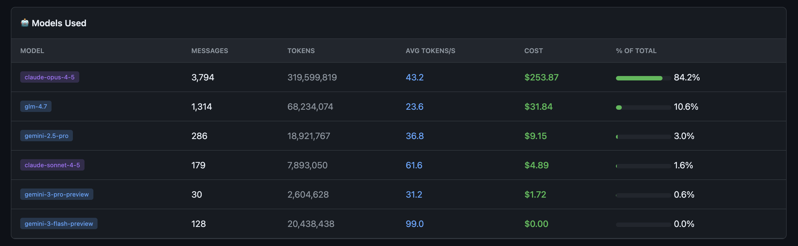
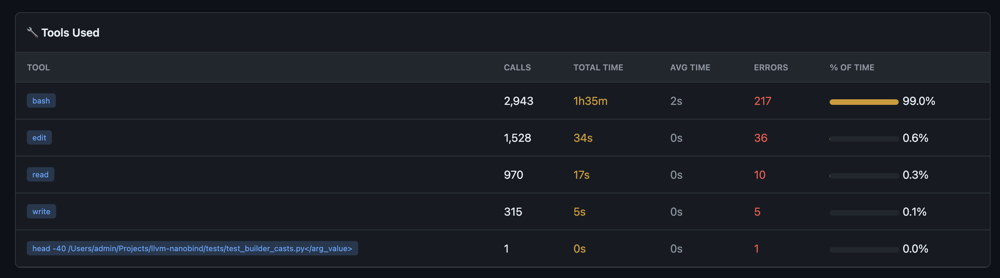
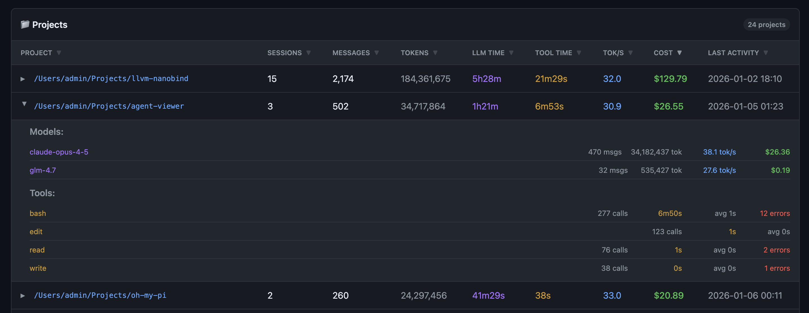
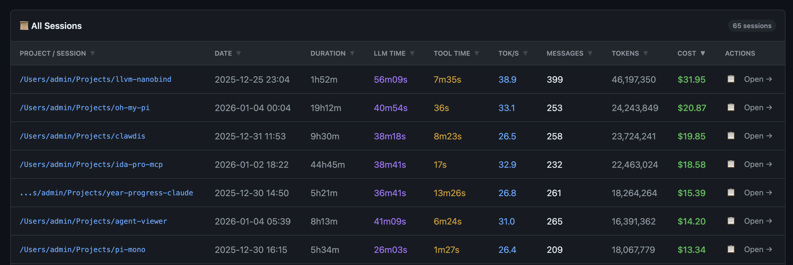

# Pi Agent Cost Dashboard

Interactive web dashboard to monitor and analyze your [Pi](https://github.com/mariozechner/pi-coding-agent) coding agent API costs.



## Features

### 📊 Global Statistics
Track your total spending across all projects and sessions:
- **Total cost** with breakdown by input, output, and cache tokens
- **Token usage** across all models
- **Session count** and project count
- **LLM time** vs tool execution time
- **Average tokens per second** across all API calls

### 📈 Daily Spending Chart
Visual timeline of your API costs over time, helping you spot trends and usage patterns.

### 🤖 Model Breakdown
See costs broken down by AI model (Claude Opus, Sonnet, Gemini, etc.):
- Messages per model
- Token usage per model
- Cost per model
- Average tokens per second



### 🔧 Tool Usage
Track which tools your agent uses most:
- Call counts per tool
- Execution time per tool
- Error rates



### 📁 Project View
All your projects with expandable details:
- Per-project cost breakdown
- Model usage per project
- Tool usage per project
- Session history per project
- Average tokens per second
- Sortable by cost, tokens, LLM time, or date



### 📜 Session Browser
Browse every session with full details:
- Copy command to resume session to the clipboard
- Full transcript export (opens in browser via `pi --export`)
- Session duration, LLM time, and tool time
- Average tokens per second
- Subagent session support with expandable grouping
- Sortable by date, duration, cost, tokens, and more



## Installation

### Requirements

- **Python 3.12+**
- **Pi** - The coding agent ([install guide](https://github.com/mariozechner/pi-coding-agent))

### Setup

```bash
# Clone this repository
git clone https://github.com/user/pi-cost-dashboard
cd pi-cost-dashboard
```

## Usage

```bash
# Start the dashboard (defaults to localhost:8753)
./cost_dashboard.py

# Use a custom port
./cost_dashboard.py --port 3000

# Bind to all interfaces (accessible from network)
./cost_dashboard.py --host 0.0.0.0

# Custom host and port
./cost_dashboard.py -H 0.0.0.0 -p 3000
```

Then open http://localhost:8753 in your browser.

The dashboard automatically reads session data from `~/.pi/agent/sessions`.

## Pricing

The dashboard calculates costs using the pricing reported by the Pi agent. For models that don't report costs (like Gemini via Google Cloud), estimated pricing is applied based on public API rates.

## Credits

- **[Mario Zechner](https://github.com/mariozechner)** - For Pi and its session export feature
